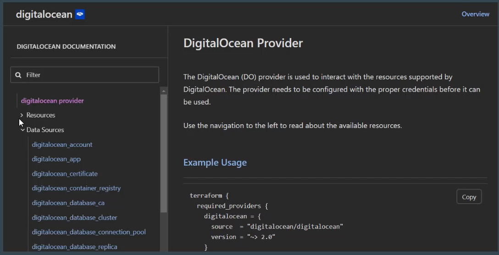

# Introducing Data Sources
Data sources allow Terraform to use /fetch information defined outside of Terraform.


## Example 1- Reading Info of Digital Ocean account
Following data source code is used to get information on your Digital Ocean account.

```
data "digitalocean_account" "example"{}

```
## Example 2- Reading file
Following data source allow you to read content of a file in your local filesystem.

```
data "local_file" "foo"{
    filename = "${PATH.module}/demo.txt"
}
```
"${PATH.module}" returns the current file system path where your code is located.

## Example 3- Fetch the Ec2 instance details
Following data source code is used to fetch detail about EC2 instance in your AWS region.

```
data "aws_instance" "example" {}

```

## Finding available Data Source
List of available datasource are associated with each resource of provider.



## Understanding the Basic Structure
a data source is accessed via a special kind of resource known as a data resource, declared using a data block.

Following data block requested that Terraform read from a given data source
("data_instance) and exports the result under the given local name ("foo")

```
data "aws_instance" "example" {}

```
## Filter Structure
Within the block body (between {and}) are query constraint defined by the data source.


