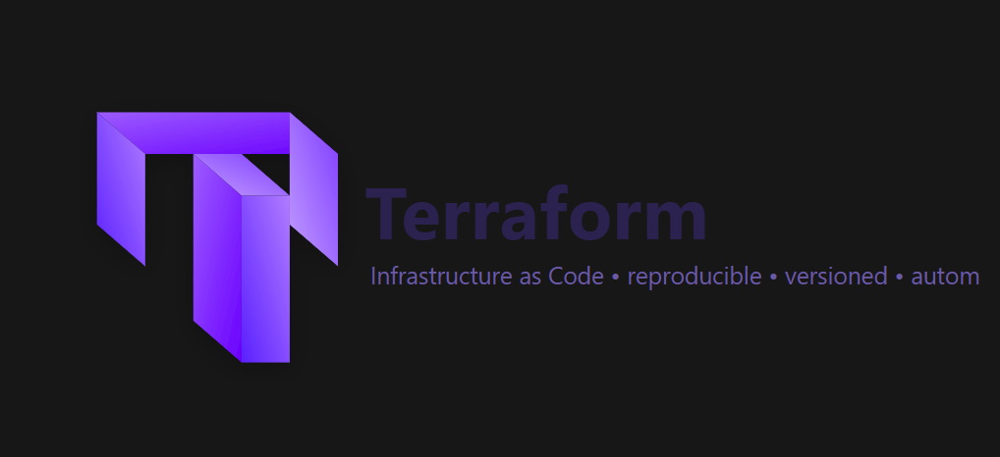

<h1 align="center"><strong><Project Name> — Terraform Infrastructure</strong></h1>

  <a href="https://www.terraform.io/">Terraform</a> enables Infrastructure as Code (IaC) so you can define, version, and automate cloud resources safely and repeatably.

  
  
  

---

## 📌 What this repo contains

- **Reusable modules** under `modules/` for <clouds/providers, e.g., AWS VPC, Azure RG, GCP networks>.
- **Environment stacks** under `envs/` (e.g., `dev`, `prod`) using the modules.
- **Remote state** configuration and recommended workflow (init → plan → apply).
- Optional **pre-commit hooks** for formatting and validation.

---

## 🔎 Why Terraform?

- **Declarative IaC**: describe *what* you want; Terraform handles the *how*.
- **Provider ecosystem**: AWS, Azure, GCP, Kubernetes, GitHub, and more.
- **Safe changes**: plans show diffs before changes are applied.
- **Versioned infra**: review infra changes via pull requests like app code.
- **Composable modules**: DRY patterns for consistent environments.

---

## 🧭 Repo layout

| No | Document Link |
|-------|---------------|
|1 | [Create EC2][PID1]|
|3 | [Create Elastic IP][PID3]|
|4 | [Provider version][PID4]|
|5| [Create Security Group][PID5]|
|6| [Documentation Code Updates][PID6]|
|7 | [Basic of Attributes][PID7]
|9 | [Terraform output][PID9]
|17| [Count meta Argument][PID17]|
|18| [Conditional Expression][PID18]|
|19| [Functions][PID19]|
|20| [Terraform Function Sample][PID20]|
|21| [Local Values][PID21]|
|22| [Data Source][PID22]|
|23| [Debugging Terraform][PID23]|
|24| [Tarrform Format][PID24]|
|25| [Load Order][PID25]|
|27| [Dynamic Blocks][PID27]|
|29| [Terraform Taining][PID29]|
|30| [Splat Experssion][PID30]|
|31| [Terraform Graph][PID31]|
|32| [Saving Terraform Plan to File][PID32]|
|33| [Terraform setting][PID33]|
|34| [Resource taregting][PID34]|
|35| [API throttling][PID35]|
|36| [Zipmap][PID36]|
|37| [Comments][PID37]|
|37| [Meta argument][PID38]|

[PID1]: <./AWS/01-Create EC2/>
[PID3]: <./AWS/03-Create Elastic IP/>
[PID4]: <./AWS/04-Provider versioning/>
[PID5]: <./AWS/05-Create Security Group/>
[PID6]: <./AWS/06-Documentation Code Updates/>
[PID7]: <./AWS/07-Basic of Attributes/>
[PID9]: <./AWS/09-Terraform output/>
[PID17]: <./AWS/17-Count meta argument>
[PID18]: <./AWS/18- Conditional Expression>
[PID19]: <./AWS/19-Functions/>
[PID20]: <./AWS/20-Terraform Functions sample>
[PID21]: <./AWS/21-local Values>
[PID22]: <./AWS/22-Data Source>
[PID23]: <./AWS/23-Debugging Terraform>
[PID24]: <./AWS/24-Terraform format>
[PID25]: <./AWS/25-Load Order/>
[PID27]: <./AWS/27-Dynamic Blocks/>
[PID29]: <./AWS/29-Terraform Taint/>
[PID30]: <./AWS/30-Splat Expression/>
[PID31]: <./AWS/31-Terraform_graph/>
[PID32]: <./AWS/32-Saving Terraform Plan to file/>
[PID33]: <./AWS/33-Terraform setting/>
[PID34]: <./AWS/34-Resource Targeting/>
[PID35]: <./AWS/35-API throttling/>
[PID36]: <./AWS/36-zipmap>
[PID37]: <./AWS/37-Comments>
[PID38]: <./AWS/38-Meta argument>
